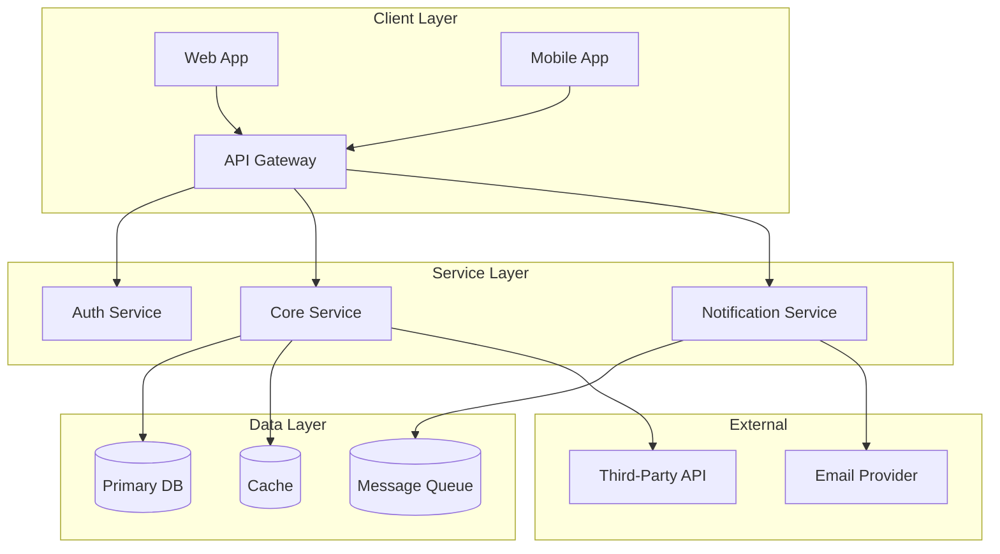
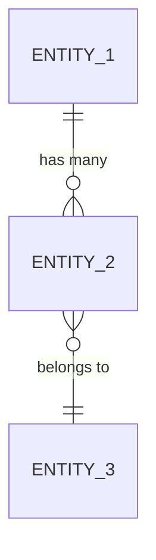
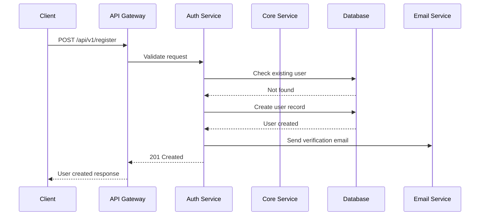
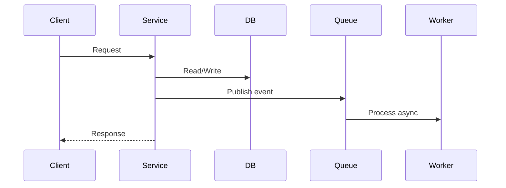

# System Design Document

| Field   | Value                  |
|---------|------------------------|
| Title   | {{system_name}}        |
| Version | {{version}}            |
| Author  | {{author}}             |
| Date    | {{date}}               |
| PRD Reference | {{prd_link}}     |

---

## Architecture Overview

{{High-level description of the system architecture. Explain the overall approach (monolith, microservices, serverless, event-driven, etc.), the key design principles guiding decisions, and how the system fits into the broader product ecosystem.}}

---

## Component Diagram



{{Replace the above with the actual component diagram for your system.}}

---

## Components

| Component | Responsibility | Technology | Interfaces | Owner |
|-----------|---------------|-----------|------------|-------|
| {{component_name}} | {{what it does}} | {{tech stack}} | {{APIs / events / protocols}} | {{team/agent}} |
| {{component_name}} | {{what it does}} | {{tech stack}} | {{APIs / events / protocols}} | {{team/agent}} |
| {{component_name}} | {{what it does}} | {{tech stack}} | {{APIs / events / protocols}} | {{team/agent}} |
| {{component_name}} | {{what it does}} | {{tech stack}} | {{APIs / events / protocols}} | {{team/agent}} |

---

## Data Models

### {{Entity 1 Name}}

```
Table: {{table_name}}
├── id            : UUID (PK)
├── created_at    : TIMESTAMP
├── updated_at    : TIMESTAMP
├── {{field_name}} : {{type}} {{constraints}}
├── {{field_name}} : {{type}} {{constraints}}
└── {{field_name}} : {{type}} {{constraints}}

Indexes:
  - idx_{{table}}_{{field}} ON ({{field}})
  - idx_{{table}}_{{field1}}_{{field2}} ON ({{field1}}, {{field2}})
```

### {{Entity 2 Name}}

```
Table: {{table_name}}
├── id            : UUID (PK)
├── created_at    : TIMESTAMP
├── updated_at    : TIMESTAMP
├── {{field_name}} : {{type}} {{constraints}}
├── {{field_name}} : {{type}} {{constraints}}
└── {{fk_field}}   : UUID (FK -> {{referenced_table}}.id)

Indexes:
  - idx_{{table}}_{{field}} ON ({{field}})
```

### Entity Relationships



{{Replace with actual entity relationship diagram.}}

---

## API Contracts

### {{Endpoint Group 1, e.g., Authentication}}

#### `POST /api/v1/{{resource}}`

**Description:** {{what this endpoint does}}

**Request:**
```json
{
  "{{field}}": "{{type}} — {{description}}",
  "{{field}}": "{{type}} — {{description}}"
}
```

**Response (200):**
```json
{
  "id": "uuid",
  "{{field}}": "{{value}}",
  "created_at": "ISO8601 timestamp"
}
```

**Error Responses:**
| Status | Code | Description |
|--------|------|-------------|
| 400 | INVALID_INPUT | {{when this occurs}} |
| 401 | UNAUTHORIZED | {{when this occurs}} |
| 404 | NOT_FOUND | {{when this occurs}} |
| 429 | RATE_LIMITED | {{when this occurs}} |

#### `GET /api/v1/{{resource}}/:id`

**Description:** {{what this endpoint does}}

**Response (200):**
```json
{
  "id": "uuid",
  "{{field}}": "{{value}}"
}
```

### {{Endpoint Group 2}}

{{Repeat the pattern above for each endpoint group.}}

---

## Sequence Diagrams

### {{Flow 1, e.g., User Registration}}



{{Replace with actual sequence diagram for your key flows.}}

### {{Flow 2, e.g., Core Business Operation}}



{{Replace with actual sequence diagrams.}}

---

## Technology Stack

| Layer | Choice | Justification | Alternatives Considered |
|-------|--------|--------------|------------------------|
| Frontend | {{e.g., Next.js 14}} | {{why this choice}} | {{e.g., Remix, SvelteKit}} |
| Backend | {{e.g., Node.js + Fastify}} | {{why this choice}} | {{e.g., Go, Python/FastAPI}} |
| Database | {{e.g., PostgreSQL 16}} | {{why this choice}} | {{e.g., MySQL, CockroachDB}} |
| Cache | {{e.g., Redis 7}} | {{why this choice}} | {{e.g., Memcached, DragonflyDB}} |
| Message Queue | {{e.g., Apache Kafka}} | {{why this choice}} | {{e.g., RabbitMQ, AWS SQS}} |
| Search | {{e.g., Elasticsearch}} | {{why this choice}} | {{e.g., Meilisearch, Typesense}} |
| Object Storage | {{e.g., AWS S3}} | {{why this choice}} | {{e.g., GCS, MinIO}} |
| CI/CD | {{e.g., GitHub Actions}} | {{why this choice}} | {{e.g., GitLab CI, CircleCI}} |
| Hosting | {{e.g., AWS EKS}} | {{why this choice}} | {{e.g., GKE, Fly.io}} |

---

## Infrastructure Requirements

### Compute
- **Application servers:** {{instance type, count, auto-scaling rules}}
- **Worker processes:** {{instance type, count, scaling triggers}}
- **Background jobs:** {{scheduling, resource allocation}}

### Storage
- **Database:** {{size estimate, IOPS requirements, backup strategy}}
- **Object storage:** {{estimated volume, lifecycle policies}}
- **Cache:** {{memory allocation, eviction policy}}

### Networking
- **Load balancer:** {{type, health checks, SSL termination}}
- **CDN:** {{provider, caching rules, invalidation strategy}}
- **DNS:** {{provider, failover configuration}}
- **VPC / Network segmentation:** {{subnet layout, security groups}}

### Estimated Costs
| Resource | Monthly Estimate | Notes |
|----------|-----------------|-------|
| Compute | ${{amount}} | {{details}} |
| Database | ${{amount}} | {{details}} |
| Storage | ${{amount}} | {{details}} |
| Networking | ${{amount}} | {{details}} |
| **Total** | **${{total}}** | |

---

## Security Considerations

- **Authentication:** {{mechanism — JWT, OAuth 2.0, API keys, etc.}}
- **Authorization:** {{model — RBAC, ABAC, policy engine}}
- **Data encryption at rest:** {{algorithm, key management}}
- **Data encryption in transit:** {{TLS version, certificate management}}
- **Input validation:** {{strategy — schema validation, sanitization}}
- **Rate limiting:** {{per-endpoint limits, DDoS protection}}
- **Secrets management:** {{tool — Vault, AWS Secrets Manager, etc.}}
- **Audit logging:** {{what is logged, retention period}}
- **Dependency scanning:** {{tool, frequency, auto-patching policy}}
- **Penetration testing:** {{schedule, scope}}

---

## Scalability Plan

### Current Target
- {{N}} concurrent users
- {{N}} requests per second
- {{N}} GB data stored

### Growth Projections (12 months)
- {{Nx}} concurrent users
- {{Nx}} requests per second
- {{Nx}} GB data stored

### Scaling Strategy
1. **Horizontal scaling:** {{how services scale out — auto-scaling groups, pod HPA}}
2. **Database scaling:** {{read replicas, sharding strategy, connection pooling}}
3. **Caching strategy:** {{cache-aside, write-through, TTL policies}}
4. **Async processing:** {{what moves to background queues at scale}}
5. **Data partitioning:** {{sharding key, partition strategy}}

---

## Monitoring & Observability

### Metrics (Golden Signals)
- **Latency:** {{p50, p95, p99 targets per endpoint}}
- **Traffic:** {{requests/sec, active users}}
- **Errors:** {{error rate threshold, error budget}}
- **Saturation:** {{CPU, memory, disk, connection pool utilization thresholds}}

### Logging
- **Structured logging format:** {{JSON, with correlation IDs}}
- **Log levels:** {{when to use each level}}
- **Log aggregation:** {{tool — Datadog, ELK, CloudWatch}}
- **Retention:** {{duration per log level}}

### Tracing
- **Distributed tracing:** {{tool — Jaeger, Zipkin, Datadog APT}}
- **Trace sampling rate:** {{percentage}}
- **Key spans to instrument:** {{list critical paths}}

### Alerting
| Alert | Condition | Severity | Notification Channel |
|-------|-----------|----------|---------------------|
| High error rate | >1% 5xx for 5 min | P1 | {{PagerDuty / Slack / Telegram}} |
| High latency | p95 > {{threshold}} for 10 min | P2 | {{channel}} |
| Database saturation | CPU > 80% for 15 min | P1 | {{channel}} |
| Disk usage | > 85% | P2 | {{channel}} |

### Dashboards
- **System overview:** request rate, error rate, latency, uptime
- **Per-service:** individual service health and performance
- **Business metrics:** user signups, conversions, revenue
- **Infrastructure:** CPU, memory, network, cost tracking
